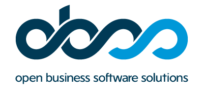

 

# DevOps Internship Program: Documentation

    Alphan Tulukcu
    Bilkent University
    August 14, 2024

# Mentors
    Yağız Küçükkambak
    Gufran Yeşilyurt
    Alper Peker
    Alper Başay
    Berkehan Avan

# Week 1

- [Introduction to DevOps](Week-1/intro-to-devops.md)

- [Devops Fundamentals](Week-1/devops-fundamentals.md)

- [Network 101](Week-1/network-101.md)

- [Python Fundamentals](Week-1/python-fundamentals.md)

- [MLOps](Week-1/mlops.md)

# Week 2

- [Container Concepts](<Week-2/container-concepts.md>)

- [Cloud Computing and Infrastructure Management](<Week-2/cloud-computing-infra.md>)

- [AWS and EC2 Overview ](<Week-2/container-concepts.md>)

- [ELK Stack](<Week-2/elk-stack.md>)

- [Message Brokers](<Week-2/message-brokers.md>)

# Week 3

- [CI Development](Week-3/ci-development.md)

- [Kubernetes](Week-3/kubernetes.md)

- [Terraform](Week-3/terraform.md)

- [CD Development](Week-3/cd-development.md)

# Week 4

- [Atlassian Cases](Week-4/atlassian.md)
