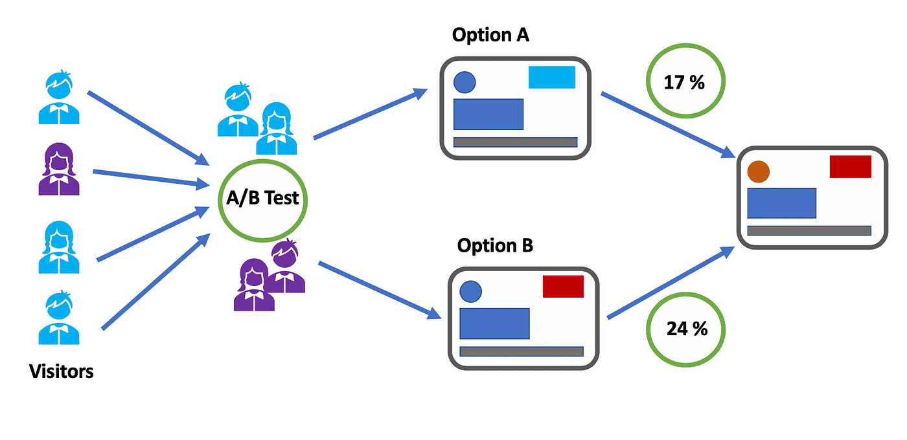
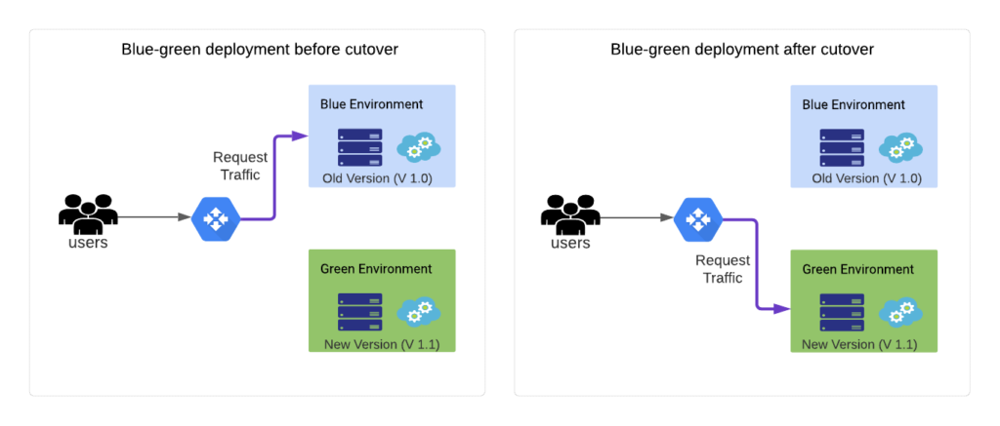

# Introduction to DevOps

In this initial CodeCamp’24 session on DevOps, I learned about the fundamental concepts and benefits of DevOps, which combines development (Dev) and operations (Ops) to enhance software delivery speed, efficiency, and security. I gained insights into the core principles of DevOps, including the importance of automation, collaboration, continuous improvement, and user-centric approaches. The session also covered the DevOps lifecycle, which spans from planning and development to deployment and monitoring. I explored various tools and methodologies, such as Git for version control and GitLab for supporting CI/CD processes. Additionally, I learned about different deployment strategies like Blue/Green Deployment and Canary Release, as well as branching strategies, including Trunk-Based Development, GitHub Flow, GitLab Flow, and GitFlow. Overall, this session provided a comprehensive understanding of how to apply DevOps practices to accelerate software development and improve product quality.

# Case-1

## Q-1

> What is A/B test? Compare with Blue/Green Deployment.

A/B testing can be used as a method to compare two versions of a product, or a specific feature to determine which one performs better based on predefined metrics such as conversion rates, click-through rates, and user evaluations. In this approach, users are randomly assigned to either version A or version B, allowing organizations to make data-driven decisions to enhance user experience and business outcomes. For instance, Instagram might use A/B testing to compare two different checkout processes to see which one results in more completed purchases such as they bring a superlike feature for users nowadays.

In contrast, Blue/Green Deployment is a deployment method for releasing new software versions with minimal downtime and risk by maintaining two identical production environments, Blue and Green. At any given time, only one environment serves production traffic, while the other is used to test the new version. If the new version is validated, traffic is switched to it, ensuring a smooth transition. An example project might involve a financial services company deploying a new version of their online banking platform. They would deploy the new version to the Green environment while the Blue environment continues to handle all user traffic. Once the new version is confirmed to be stable and functioning correctly, the company would switch all traffic from Blue to Green. For example, Instagram might use Blue/Green Deployment strategy when they serves the 'Reels' feature for all customers at the same time. 

While A/B testing focuses on optimizing user experience through direct comparison by exposing users to different versions simultaneously, Blue/Green Deployment aims to ensure stability and reliability during software releases by minimizing the impact of potential issues through a controlled switch between environments. 

I can give a example to understand both concepts and their differences. 
We can consider these stragegies with the following example:
There are two restaurants and both want to serve a new kebab. First one serves only 20% of the people to observe their evaluations, and then they serve it to all customers. The other restaurant serve the product to all people at the same time. The difference can be said that first one try to reduce risk, but the second one try to keep the maintenance.

## Q-2

> What is Rolling Update? How can we use Rolling Update in our deployment processes?

A rolling update is a deployment approach that minimizes downtime and maintains application availability by progressively updating software across servers or instances in a controlled manner. A rolling update updates a portion of the servers at a time, sparing the other servers from having to update all of them at once and enabling them to continue handling traffic. Using this approach, the servers are divided into batches, and each batch is updated in turn. Prior to moving on, a health check is carried out following each update to guarantee stability. Rolling updates facilitate seamless software version transitions while lowering the possibility of widespread failures by utilizing automation technologies like Ansible or Kubernetes to automate the process and load balancers to control traffic distribution.This approach ensures continuous service availability and allows for quick rollbacks if issues arise during the update.

Rolling updates are heavily used in many web app deployments such as Netflix. When introducing new features, Netflix uses rolling upgrades to guarantee uninterrupted service and little downtime. For example, Netflix carries out health checks at each stage while progressively upgrading a portion of instances in a single region while updating its user recommendation service. If the first changes go well, more regions will get the rollout. System performance and health are continuously tracked during the process, and any problems result in an instant rollback. With this strategy, Netflix can introduce changes smoothly and keep up a top-notch user experience.

# Case-2

> How can a DevOps architecture be created to automate continuous integration (CI) and continuous deployment (CD) processes for an e-commerce platform,
thereby accelerating the software development cycle and increasing reliability?

A DevOps design must have a number of crucial components in order to automate Continuous Integration (CI) and Continuous Deployment (CD) procedures for an e-commerce platform. This will speed up the software development cycle and boost reliability. Using tools like Jenkins, GitLab CI, or CircleCI, create a continuous integration (CI) pipeline first. This will allow developers' code changes to be automatically tested and incorporated into the main codebase. To guarantee the functionality and quality of the code, this involves configuring automated unit, integration, and end-to-end tests. Next, use tools like Kubernetes, Docker, and Helm to construct a continuous integration pipeline that deploys the tested code to production and staging environments. Infrastructure can be systematically managed and provisioned using Infrastructure-as-Code (IaC) tools such as Terraform or AWS CloudFormation. Prometheus and ELK Stack are two examples of continuous monitoring and logging systems that offer real-time insights and alerts for system performance and health. Practices like feature flags and blue-green deployments enable safe, incremental releases as well as prompt rollbacks when necessary. The e-commerce platform may accomplish quicker release cycles, lessen manual intervention, increase overall system stability, and boost customer happiness by automating CI/CD operations.

For example, I can give a imaginary example with Trendyol. To automate continuous integration and delivery (CI/CD) for Trendyol, developers might send changes to GitHub or Jenkins, which would then start pipelines for CI/CD automation from those systems. To guarantee code quality, these pipelines perform automated unit, integration, and end-to-end testing. Docker is used to containerize successful code changes, which are then deployed to a staging environment under Kubernetes management. Blue-green deployment is used to push out the new version to production following verification in staging. Older instances of the system continue to serve traffic while new instances are gradually updated. Real-time insights and alarms are provided through continuous monitoring with tools like Prometheus and ELK Stack. Should problems occur, a fast rollback is carried out. Trendyol can provide updates more quickly and consistently thanks to this automated DevOps architecture, which also improves user happiness and system stability.
