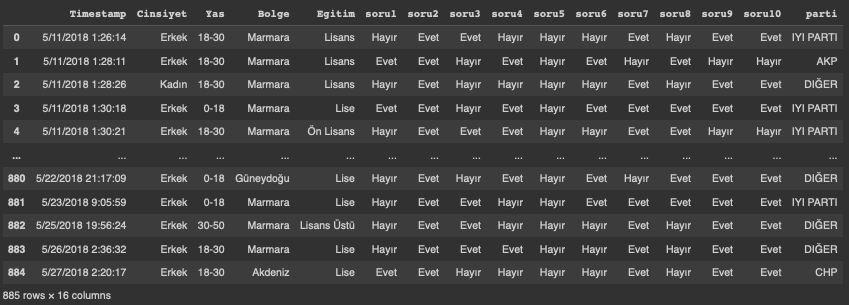
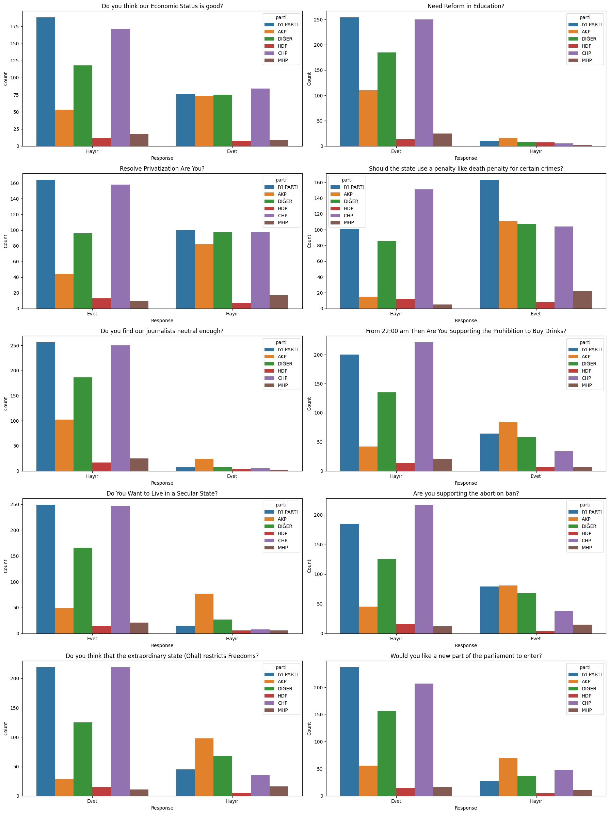
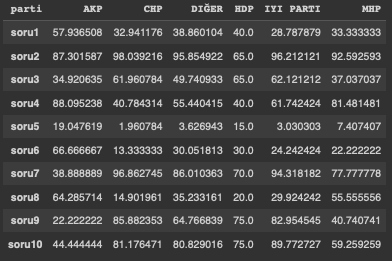

# Python Fundamentals

In the fourth CodeCamp'24, the focus was on Python Fundamentals with a particular emphasis on the applications of Python in Data Science and Machine Learning. The session, led by Gufran Yeşilyurt, covered various essential topics ranging from basic programming exercises to advanced machine learning concepts. Here’s a detailed summary:

## Introduction to Data Science
The session differentiated between Data Science, Data Analysis, and Data Engineering:

> **Data Science** involves predictive analytics and machine learning to derive insights and forecasts.

> **Data Analysis** focuses on cleaning and transforming data to extract information.

> **Data Engineering** deals with the infrastructure and pipelines that facilitate data processing.

## Data Science Life Cycle

> **Problem Understanding:** Defining the problem and the objectives.

> **Data Acquisition:** Collecting and consolidating data.

> **Data Wrangling:** Preprocessing data to handle missing values and outliers.

> **Data Exploration:** Visualizing and statistically analyzing data.

> **Feature Engineering:** Selecting and transforming variables for modeling.

> **Modeling:** Building predictive models.

> **Deployment:** Deploying the model for real-world use.

> **Monitoring:** Tracking the performance of the deployed model.

## Types of Data

> **Structured Data:** Organized in rows and columns (e.g., relational databases).

> **Semi-Structured Data:** Not strictly organized but follows a certain structure (e.g., JSON, XML).

> **Unstructured Data:** Lacks a predefined structure (e.g., images, videos).

## Essential Python Libraries
> **Beautiful Soup:** We can use for web scraping HTML and XML files.

> **Scrapy:** Another web scraping framework but with a more systematic approach.

> **Numpy:** For handling multi-dimensional arrays and performing matrix operations.

> **Pandas:** For data manipulation and analysis using DataFrames.

# Machine Learning Fundamentals


In this part, we covered various types of machine learning:

> **Supervised Learning:** Models are trained on labeled data (e.g., Regression, Classification).

> **Unsupervised Learning:** Models identify patterns without labels (e.g., Clustering, Association Rule Mining).

## Regression Analysis
We explored the various concepts of regression:

> **Univariate Linear Regression:** Simple linear regression with one independent variable.

> **Multivariate Linear Regression:** Multiple independent variables are used to predict the outcome.

> **Feature Scaling:** Normalization and standardization techniques to scale features.

## Regularization Techniques
To prevent overfitting, various regularization methods were introduced:

> **Ridge Regression (L2 Regularization):** Adds a penalty equivalent to the square of the magnitude of coefficients.

> **Lasso Regression (L1 Regularization):** Can shrink some coefficients to zero, effectively selecting features.

> **Elastic Net:** A combination of L1 and L2 regularization.

## Model Evaluation Metrics
The session covered how to evaluate the performance of models:

1. Mean Absolute Error (MAE)
2. Mean Squared Error (MSE)
3. R² Score
4. Cross-Validation

## Classification Algorithms
An introduction to various classification techniques was provided:

> **Logistic Regression:** For binary classification problems.

> **Support Vector Machines (SVM):** For both linear and non-linear classification, utilizing the kernel trick for non-linear boundaries.

> **Decision Trees:** A flowchart-like tree structure for making decisions and predictions.

## Hyper-Parameter Optimization
Techniques to optimize model parameters were discussed:

> **Grid Search:** Exhaustive search over specified parameter values.

> **Random Search:** Random combinations of parameters to find the best model configuration.

# Case - Political Prediction for Turkey

In this project, I tried to predict some survey questions' answers with using Turkish citizens's supporting political partie by using the following Machine Learning models:

    1. Logistic Regression
    2. Random Forest
    3. Gradient Boosting
    4. Support Vector Classifier

> You can look the [Google Colab](https://colab.research.google.com/drive/1L_RGu_ui3P0aJ3UPrx_OULI40ywZzwOj?usp=sharing) to run my code, or use the ```Untitled3.ipynb``` file in this repo:

## Dataset
I used the [Turkey Political Opinions](https://www.kaggle.com/datasets/yemregundogmus/turkey-political-opinions/data) dataset to train my models

## Requirements

We should install the following pip packages: 

```
!pip install matplotlib seaborn pandas scikit-learn
```

## Libraries
I imported the following libraries:

```py
import pandas as pd
import numpy as np
import matplotlib.pyplot as plt
import seaborn as sns
import warnings
from sklearn.model_selection import train_test_split
from sklearn.linear_model import LinearRegression
from sklearn.preprocessing import LabelEncoder
from sklearn.pipeline import Pipeline
from sklearn.ensemble import RandomForestClassifier
from sklearn.metrics import classification_report
from sklearn.linear_model import LogisticRegression
from sklearn.ensemble import RandomForestClassifier, GradientBoostingClassifier
from sklearn.svm import SVC
from sklearn.metrics import classification_report
```
## Load the dataset
We can convert csv file to a pandas DataFrame like below:
```py
dataset = pd.read_csv('/content/yonelimfinal.csv')
dataset
```
> Output:




## Check for Missing Values and Describe the Dataset
We should check are there any null values in the dataset like below:
```py
dataset.isnull().sum()
```
## Get descriptive statistics
We can look ad describe of the dataset like below:
```py
dataset.describe()
```
## Visualize Survey Responses by Party
I used ```matplotlib``` and ```seaborn``` to visualise each question's statistics related to the parties:

```py
questions = {
    'soru1': 'Do you think our Economic Status is good?',
    'soru2': 'Need Reform in Education?',
    'soru3': 'Resolve Privatization Are You?',
    'soru4': 'Should the state use a penalty like death penalty for certain crimes?',
    'soru5': 'Do you find our journalists neutral enough?',
    'soru6': 'From 22:00 am Then Are You Supporting the Prohibition to Buy Drinks?',
    'soru7': 'Do You Want to Live in a Secular State?',
    'soru8': 'Are you supporting the abortion ban?',
    'soru9': 'Do you think that the extraordinary state (Ohal) restricts Freedoms?',
    'soru10': 'Would you like a new part of the parliament to enter?'
}

## Set up the matplotlib figure
fig, axes = plt.subplots(nrows=5, ncols=2, figsize=(18, 24))
fig.subplots_adjust(hspace=0.5)

## Create the count plots
for idx, (soru, title) in enumerate(questions.items()):
    row, col = divmod(idx, 2)
    sns.countplot(data=dataset, x=soru, hue='parti', ax=axes[row, col])
    axes[row, col].set_title(title)
    axes[row, col].set_xlabel('Response')
    axes[row, col].set_ylabel('Count')

## Adjust layout and show the plots
plt.tight_layout()
plt.show()
```
> Output:




## Calculate the Percentage of 'Evet' Responses for Each Party
I calculated the answer's percentage for each party to understand the model:
```py
# Convert 'Evet' to 1 and 'Hayır' to 0 for all questions
df = dataset.copy()
df = df.drop(columns=['Timestamp'])
questions_columns = [col for col in df.columns if 'soru' in col]
df[questions_columns] = df[questions_columns].applymap(lambda x: 1 if x == 'Evet' else 0)

# Calculate the percentage of 'Evet' responses for each party and each question
percentage_results = {}
for soru in questions:
    percentage_results[soru] = df.groupby('parti')[soru].mean() * 100

# Display the results
percentage_results_df = pd.DataFrame(percentage_results).transpose()
print(percentage_results_df)
```
> Output:




## Predict Party Affiliation Using Multiple Models
```py
# Encode the party labels
df = dataset.copy()
df = df.drop(columns=['Timestamp'])
df[questions_columns] = df[questions_columns].applymap(lambda x: 1 if x == 'Evet' else 0)
label_encoder = LabelEncoder()
df['parti'] = label_encoder.fit_transform(df['parti'])
```
## Define the models to be used
```py
models = {
    'Logistic Regression': LogisticRegression(max_iter=1000),
    'Random Forest': RandomForestClassifier(random_state=42),
    'Gradient Boosting': GradientBoostingClassifier(random_state=42),
    'Support Vector Classifier': SVC()
}
```
## Function to train and evaluate a model for a given question
I wrote ```train_and_evaluate``` method to train each model for each question in a loop in the next section. I arrange the ```test_size``` as ```0.2``` to get better performances:
```py
def train_and_evaluate(question, model):
    X = df[['parti']]
    y = df[question]

    # Split the data into training and test sets
    X_train, X_test, y_train, y_test = train_test_split(X, y, test_size=0.2, random_state=42)

    # Create and train the model
    model.fit(X_train, y_train)

    # Make predictions
    y_pred = model.predict(X_test)

    # Evaluate the model
    report = classification_report(y_test, y_pred, output_dict=True)
    report_df = pd.DataFrame(report).transpose()

    return report_df
```
## Train and evaluate the models for each question
In this loop, I trained each model for each question in a loop and save the results to display:
```py
results = {}
for model_name, model in models.items():
    results[model_name] = {}
    for question in questions:
        results[model_name][question] = train_and_evaluate(question, model)
```
## Display the results
This part displays results in an appropriate format:
```py
for model_name, model_results in results.items():
    print(f"Results for {model_name}\n" + "="*80)
    for question, report_df in model_results.items():
        print(f"Classification Report for {questions[question]}")
        print(report_df)
        print("\n" + "-"*80 + "\n")
```

# Outputs for each Model:

## Results for Logistic Regression
```
================================================================================
Classification Report for Do you think our Economic Status is good?
              precision    recall  f1-score     support
0              0.649718  1.000000  0.787671  115.000000
1              0.000000  0.000000  0.000000   62.000000
accuracy       0.649718  0.649718  0.649718    0.649718
macro avg      0.324859  0.500000  0.393836  177.000000
weighted avg   0.422133  0.649718  0.511764  177.000000

--------------------------------------------------------------------------------

Classification Report for Need Reform in Education?
              precision    recall  f1-score     support
0              0.000000  0.000000  0.000000   13.000000
1              0.926554  1.000000  0.961877  164.000000
accuracy       0.926554  0.926554  0.926554    0.926554
macro avg      0.463277  0.500000  0.480938  177.000000
weighted avg   0.858502  0.926554  0.891231  177.000000

--------------------------------------------------------------------------------

Classification Report for Resolve Privatization Are You?
              precision    recall  f1-score     support
0              0.000000  0.000000  0.000000   82.000000
1              0.536723  1.000000  0.698529   95.000000
accuracy       0.536723  0.536723  0.536723    0.536723
macro avg      0.268362  0.500000  0.349265  177.000000
weighted avg   0.288072  0.536723  0.374917  177.000000

--------------------------------------------------------------------------------

Classification Report for Should the state use a penalty like death penalty for certain crimes?
              precision    recall  f1-score     support
0              0.000000  0.000000  0.000000   68.000000
1              0.615819  1.000000  0.762238  109.000000
accuracy       0.615819  0.615819  0.615819    0.615819
macro avg      0.307910  0.500000  0.381119  177.000000
weighted avg   0.379233  0.615819  0.469401  177.000000

--------------------------------------------------------------------------------

Classification Report for Do you find our journalists neutral enough?
              precision    recall  f1-score     support
0              0.954802  1.000000  0.976879  169.000000
1              0.000000  0.000000  0.000000    8.000000
accuracy       0.954802  0.954802  0.954802    0.954802
macro avg      0.477401  0.500000  0.488439  177.000000
weighted avg   0.911647  0.954802  0.932726  177.000000

--------------------------------------------------------------------------------

Classification Report for From 22:00 am Then Are You Supporting the Prohibition to Buy Drinks?
              precision    recall  f1-score     support
0              0.762712  1.000000  0.865385  135.000000
1              0.000000  0.000000  0.000000   42.000000
accuracy       0.762712  0.762712  0.762712    0.762712
macro avg      0.381356  0.500000  0.432692  177.000000
weighted avg   0.581729  0.762712  0.660039  177.000000

--------------------------------------------------------------------------------

Classification Report for Do You Want to Live in a Secular State?
              precision    recall  f1-score     support
0              0.000000  0.000000  0.000000   27.000000
1              0.847458  1.000000  0.917431  150.000000
accuracy       0.847458  0.847458  0.847458    0.847458
macro avg      0.423729  0.500000  0.458716  177.000000
weighted avg   0.718184  0.847458  0.777484  177.000000

--------------------------------------------------------------------------------

Classification Report for Are you supporting the abortion ban?
              precision    recall  f1-score     support
0              0.672316  1.000000  0.804054  119.000000
1              0.000000  0.000000  0.000000   58.000000
accuracy       0.672316  0.672316  0.672316    0.672316
macro avg      0.336158  0.500000  0.402027  177.000000
weighted avg   0.452009  0.672316  0.540579  177.000000

--------------------------------------------------------------------------------

Classification Report for Do you think that the extraordinary state (Ohal) restricts Freedoms?
              precision    recall  f1-score     support
0              0.000000  0.000000  0.000000   54.000000
1              0.694915  1.000000  0.820000  123.000000
accuracy       0.694915  0.694915  0.694915    0.694915
macro avg      0.347458  0.500000  0.410000  177.000000
weighted avg   0.482907  0.694915  0.569831  177.000000

--------------------------------------------------------------------------------

Classification Report for Would you like a new part of the parliament to enter?
              precision    recall  f1-score     support
0              0.000000  0.000000  0.000000   41.000000
1              0.768362  1.000000  0.869010  136.000000
accuracy       0.768362  0.768362  0.768362    0.768362
macro avg      0.384181  0.500000  0.434505  177.000000
weighted avg   0.590380  0.768362  0.667714  177.000000

--------------------------------------------------------------------------------
```
## Results for Random Forest
```
================================================================================
Classification Report for Do you think our Economic Status is good?
              precision    recall  f1-score     support
0              0.708609  0.930435  0.804511  115.000000
1              0.692308  0.290323  0.409091   62.000000
accuracy       0.706215  0.706215  0.706215    0.706215
macro avg      0.700458  0.610379  0.606801  177.000000
weighted avg   0.702899  0.706215  0.666002  177.000000

--------------------------------------------------------------------------------

Classification Report for Need Reform in Education?
              precision    recall  f1-score     support
0              0.000000  0.000000  0.000000   13.000000
1              0.926554  1.000000  0.961877  164.000000
accuracy       0.926554  0.926554  0.926554    0.926554
macro avg      0.463277  0.500000  0.480938  177.000000
weighted avg   0.858502  0.926554  0.891231  177.000000

--------------------------------------------------------------------------------

Classification Report for Resolve Privatization Are You?
              precision    recall  f1-score    support
0              0.580645  0.439024  0.500000   82.00000
1              0.600000  0.726316  0.657143   95.00000
accuracy       0.593220  0.593220  0.593220    0.59322
macro avg      0.590323  0.582670  0.578571  177.00000
weighted avg   0.591033  0.593220  0.584342  177.00000

--------------------------------------------------------------------------------

Classification Report for Should the state use a penalty like death penalty for certain crimes?
              precision    recall  f1-score     support
0              0.580645  0.529412  0.553846   68.000000
1              0.721739  0.761468  0.741071  109.000000
accuracy       0.672316  0.672316  0.672316    0.672316
macro avg      0.651192  0.645440  0.647459  177.000000
weighted avg   0.667534  0.672316  0.669143  177.000000

--------------------------------------------------------------------------------

Classification Report for Do you find our journalists neutral enough?
              precision    recall  f1-score     support
0              0.954802  1.000000  0.976879  169.000000
1              0.000000  0.000000  0.000000    8.000000
accuracy       0.954802  0.954802  0.954802    0.954802
macro avg      0.477401  0.500000  0.488439  177.000000
weighted avg   0.911647  0.954802  0.932726  177.000000

--------------------------------------------------------------------------------

Classification Report for From 22:00 am Then Are You Supporting the Prohibition to Buy Drinks?
              precision    recall  f1-score     support
0              0.841060  0.940741  0.888112  135.000000
1              0.692308  0.428571  0.529412   42.000000
accuracy       0.819209  0.819209  0.819209    0.819209
macro avg      0.766684  0.684656  0.708762  177.000000
weighted avg   0.805763  0.819209  0.802997  177.000000

--------------------------------------------------------------------------------

Classification Report for Do You Want to Live in a Secular State?
              precision    recall  f1-score     support
0              0.538462  0.518519  0.528302   27.000000
1              0.913907  0.920000  0.916944  150.000000
accuracy       0.858757  0.858757  0.858757    0.858757
macro avg      0.726184  0.719259  0.722623  177.000000
weighted avg   0.856636  0.858757  0.857659  177.000000

--------------------------------------------------------------------------------

Classification Report for Are you supporting the abortion ban?
              precision    recall  f1-score     support
0              0.758621  0.924370  0.833333  119.000000
1              0.718750  0.396552  0.511111   58.000000
accuracy       0.751412  0.751412  0.751412    0.751412
macro avg      0.738685  0.660461  0.672222  177.000000
weighted avg   0.745556  0.751412  0.727746  177.000000

--------------------------------------------------------------------------------

Classification Report for Do you think that the extraordinary state (Ohal) restricts Freedoms?
              precision    recall  f1-score    support
0              0.781250  0.462963  0.581395   54.00000
1              0.800000  0.943089  0.865672  123.00000
accuracy       0.796610  0.796610  0.796610    0.79661
macro avg      0.790625  0.703026  0.723533  177.00000
weighted avg   0.794280  0.796610  0.778943  177.00000

--------------------------------------------------------------------------------

Classification Report for Would you like a new part of the parliament to enter?
              precision    recall  f1-score     support
0              0.500000  0.317073  0.388060   41.000000
1              0.814570  0.904412  0.857143  136.000000
accuracy       0.768362  0.768362  0.768362    0.768362
macro avg      0.657285  0.610742  0.622601  177.000000
weighted avg   0.741703  0.768362  0.748485  177.000000

--------------------------------------------------------------------------------
```
## Results for Gradient Boosting
```
================================================================================
Classification Report for Do you think our Economic Status is good?
              precision    recall  f1-score     support
0              0.708609  0.930435  0.804511  115.000000
1              0.692308  0.290323  0.409091   62.000000
accuracy       0.706215  0.706215  0.706215    0.706215
macro avg      0.700458  0.610379  0.606801  177.000000
weighted avg   0.702899  0.706215  0.666002  177.000000

--------------------------------------------------------------------------------

Classification Report for Need Reform in Education?
              precision    recall  f1-score     support
0              0.000000  0.000000  0.000000   13.000000
1              0.926554  1.000000  0.961877  164.000000
accuracy       0.926554  0.926554  0.926554    0.926554
macro avg      0.463277  0.500000  0.480938  177.000000
weighted avg   0.858502  0.926554  0.891231  177.000000

--------------------------------------------------------------------------------

Classification Report for Resolve Privatization Are You?
              precision    recall  f1-score    support
0              0.580645  0.439024  0.500000   82.00000
1              0.600000  0.726316  0.657143   95.00000
accuracy       0.593220  0.593220  0.593220    0.59322
macro avg      0.590323  0.582670  0.578571  177.00000
weighted avg   0.591033  0.593220  0.584342  177.00000

--------------------------------------------------------------------------------

Classification Report for Should the state use a penalty like death penalty for certain crimes?
              precision    recall  f1-score     support
0              0.580645  0.529412  0.553846   68.000000
1              0.721739  0.761468  0.741071  109.000000
accuracy       0.672316  0.672316  0.672316    0.672316
macro avg      0.651192  0.645440  0.647459  177.000000
weighted avg   0.667534  0.672316  0.669143  177.000000

--------------------------------------------------------------------------------

Classification Report for Do you find our journalists neutral enough?
              precision    recall  f1-score     support
0              0.954802  1.000000  0.976879  169.000000
1              0.000000  0.000000  0.000000    8.000000
accuracy       0.954802  0.954802  0.954802    0.954802
macro avg      0.477401  0.500000  0.488439  177.000000
weighted avg   0.911647  0.954802  0.932726  177.000000

--------------------------------------------------------------------------------

Classification Report for From 22:00 am Then Are You Supporting the Prohibition to Buy Drinks?
              precision    recall  f1-score     support
0              0.841060  0.940741  0.888112  135.000000
1              0.692308  0.428571  0.529412   42.000000
accuracy       0.819209  0.819209  0.819209    0.819209
macro avg      0.766684  0.684656  0.708762  177.000000
weighted avg   0.805763  0.819209  0.802997  177.000000

--------------------------------------------------------------------------------

Classification Report for Do You Want to Live in a Secular State?
              precision    recall  f1-score     support
0              0.538462  0.518519  0.528302   27.000000
1              0.913907  0.920000  0.916944  150.000000
accuracy       0.858757  0.858757  0.858757    0.858757
macro avg      0.726184  0.719259  0.722623  177.000000
weighted avg   0.856636  0.858757  0.857659  177.000000

--------------------------------------------------------------------------------

Classification Report for Are you supporting the abortion ban?
              precision    recall  f1-score     support
0              0.758621  0.924370  0.833333  119.000000
1              0.718750  0.396552  0.511111   58.000000
accuracy       0.751412  0.751412  0.751412    0.751412
macro avg      0.738685  0.660461  0.672222  177.000000
weighted avg   0.745556  0.751412  0.727746  177.000000

--------------------------------------------------------------------------------

Classification Report for Do you think that the extraordinary state (Ohal) restricts Freedoms?
              precision    recall  f1-score    support
0              0.781250  0.462963  0.581395   54.00000
1              0.800000  0.943089  0.865672  123.00000
accuracy       0.796610  0.796610  0.796610    0.79661
macro avg      0.790625  0.703026  0.723533  177.00000
weighted avg   0.794280  0.796610  0.778943  177.00000

--------------------------------------------------------------------------------

Classification Report for Would you like a new part of the parliament to enter?
              precision    recall  f1-score     support
0              0.500000  0.317073  0.388060   41.000000
1              0.814570  0.904412  0.857143  136.000000
accuracy       0.768362  0.768362  0.768362    0.768362
macro avg      0.657285  0.610742  0.622601  177.000000
weighted avg   0.741703  0.768362  0.748485  177.000000

--------------------------------------------------------------------------------
```
## Results for Support Vector Classifier
```
================================================================================
Classification Report for Do you think our Economic Status is good?
              precision    recall  f1-score     support
0              0.708609  0.930435  0.804511  115.000000
1              0.692308  0.290323  0.409091   62.000000
accuracy       0.706215  0.706215  0.706215    0.706215
macro avg      0.700458  0.610379  0.606801  177.000000
weighted avg   0.702899  0.706215  0.666002  177.000000

--------------------------------------------------------------------------------

Classification Report for Need Reform in Education?
              precision    recall  f1-score     support
0              0.000000  0.000000  0.000000   13.000000
1              0.926554  1.000000  0.961877  164.000000
accuracy       0.926554  0.926554  0.926554    0.926554
macro avg      0.463277  0.500000  0.480938  177.000000
weighted avg   0.858502  0.926554  0.891231  177.000000

--------------------------------------------------------------------------------

Classification Report for Resolve Privatization Are You?
              precision    recall  f1-score    support
0              0.580645  0.439024  0.500000   82.00000
1              0.600000  0.726316  0.657143   95.00000
accuracy       0.593220  0.593220  0.593220    0.59322
macro avg      0.590323  0.582670  0.578571  177.00000
weighted avg   0.591033  0.593220  0.584342  177.00000

--------------------------------------------------------------------------------

Classification Report for Should the state use a penalty like death penalty for certain crimes?
              precision    recall  f1-score     support
0              0.578947  0.485294  0.528000   68.000000
1              0.708333  0.779817  0.742358  109.000000
accuracy       0.666667  0.666667  0.666667    0.666667
macro avg      0.643640  0.632555  0.635179  177.000000
weighted avg   0.658626  0.666667  0.660006  177.000000

--------------------------------------------------------------------------------

Classification Report for Do you find our journalists neutral enough?
              precision    recall  f1-score     support
0              0.954802  1.000000  0.976879  169.000000
1              0.000000  0.000000  0.000000    8.000000
accuracy       0.954802  0.954802  0.954802    0.954802
macro avg      0.477401  0.500000  0.488439  177.000000
weighted avg   0.911647  0.954802  0.932726  177.000000

--------------------------------------------------------------------------------

Classification Report for From 22:00 am Then Are You Supporting the Prohibition to Buy Drinks?
              precision    recall  f1-score     support
0              0.841060  0.940741  0.888112  135.000000
1              0.692308  0.428571  0.529412   42.000000
accuracy       0.819209  0.819209  0.819209    0.819209
macro avg      0.766684  0.684656  0.708762  177.000000
weighted avg   0.805763  0.819209  0.802997  177.000000

--------------------------------------------------------------------------------

Classification Report for Do You Want to Live in a Secular State?
              precision    recall  f1-score     support
0              0.538462  0.518519  0.528302   27.000000
1              0.913907  0.920000  0.916944  150.000000
accuracy       0.858757  0.858757  0.858757    0.858757
macro avg      0.726184  0.719259  0.722623  177.000000
weighted avg   0.856636  0.858757  0.857659  177.000000

--------------------------------------------------------------------------------

Classification Report for Are you supporting the abortion ban?
              precision    recall  f1-score     support
0              0.758621  0.924370  0.833333  119.000000
1              0.718750  0.396552  0.511111   58.000000
accuracy       0.751412  0.751412  0.751412    0.751412
macro avg      0.738685  0.660461  0.672222  177.000000
weighted avg   0.745556  0.751412  0.727746  177.000000

--------------------------------------------------------------------------------

Classification Report for Do you think that the extraordinary state (Ohal) restricts Freedoms?
              precision    recall  f1-score    support
0              0.781250  0.462963  0.581395   54.00000
1              0.800000  0.943089  0.865672  123.00000
accuracy       0.796610  0.796610  0.796610    0.79661
macro avg      0.790625  0.703026  0.723533  177.00000
weighted avg   0.794280  0.796610  0.778943  177.00000

--------------------------------------------------------------------------------

Classification Report for Would you like a new part of the parliament to enter?
              precision    recall  f1-score     support
0              0.500000  0.317073  0.388060   41.000000
1              0.814570  0.904412  0.857143  136.000000
accuracy       0.768362  0.768362  0.768362    0.768362
macro avg      0.657285  0.610742  0.622601  177.000000
weighted avg   0.741703  0.768362  0.748485  177.000000

--------------------------------------------------------------------------------
```
