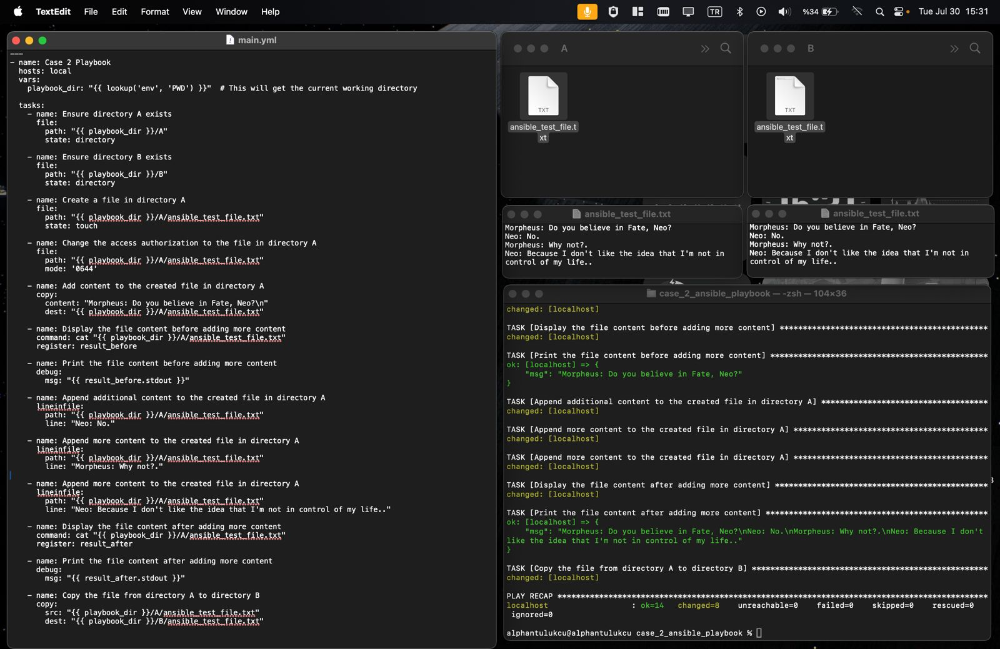

#### **Cloud Computing & Infrastructure Management**

**Infrastructure as Code (IaC)**
IaC is the practice of managing and provisioning computing infrastructure through machine-readable configuration files rather than physical hardware configuration or interactive configuration tools.

**Benefits of IaC:**

> **Automation:** Automates the creation and management of environments, reducing manual effort and errors.

> **Portability:** Easily duplicate environments across different systems or locations.

> **Error Reduction:** Minimizes configuration errors and supports version control for quick rollback to stable configurations.

> **Scalability:** Efficiently scale resources up or down based on demand.

**How IaC Works:**

> **Declarative Approach:** Describes the desired state of the system without specifying the steps to achieve it.

> **Imperative Approach:** Specifies the exact steps needed to achieve the desired system state, useful in complex deployments.

### Role of IaC in DevOps
IaC integrates with DevOps practices to automate infrastructure tasks within CI/CD pipelines, ensuring rapid and consistent deployment across environments. It provides a common language for developers and operations teams, enhancing collaboration and transparency.

**IaC Tools:**
- **Ansible**
- **Puppet**
- **Chef**
- **AWS CloudFormation**
- **Google Cloud Deployment Manager**
- **Azure Resource Manager**
- **Vagrant**
- **Terraform**
- **Pulumi**
- **env0**

## YAML Development

YAML (Yet Another Markup Language) is a human-readable data serialization format commonly used in DevOps for configuration files and CI/CD pipelines. It is known for its simplicity and readability, using `.yml` or `.yaml` extensions.

**YAML Syntax**
- **Scalars:** Basic data types such as strings, integers, and booleans.
- **Collections:** Supports sequences (lists) and mappings (dictionaries).
- **Special Characters:** 

    `|` for multiline strings.
  
    `>` to fold multiline strings into a single line.

### **XML vs. YAML:** 

YAML is more human-readable and concise compared to XML.

### **JSON vs. YAML:** 

YAML is more user-friendly with less punctuation, making it easier to read and write.

### Where is YAML Used?

- **Ansible:** YAML is used in Ansible playbooks to define the desired state of systems. Playbooks consist of a series of tasks that automate IT processes.

# Case 1 | Swagger.io

    Enter the editor.swagger.io. Inspect the example YAML File. Generate a new YAML File about these topics: (if you have another idea you can change the topic)

    Topics

    Select one of them

    - Car Factory
    - Banking Service
    - Social Media Page

    Case Rules

    - It must contain GET, POST, and DELETE requests.
    - It must have a schema.
    - After finishing, you can load the YAML file to GitLab Repository

## Formula 1 API

I created a Formula 1 API to retrive, add and delete drivers. 

## YAML File Contents

```yaml
openapi: 3.0.1
info:
  title: Formula 1 API
  description: API for managing Formula 1 drivers
  version: 1.0.0
servers:
  - url: https://api.formula1.com/v1
paths:
  /drivers:
    get:
      summary: Retrieve a list of drivers
      responses:
        '200':
          description: A list of drivers
          content:
            application/json:
              schema:
                type: array
                items:
                  $ref: '#/components/schemas/Driver'
        '500':
          description: Internal server error
          content:
            application/json:
              schema:
                $ref: '#/components/schemas/Error'
    post:
      summary: Add a new driver
      requestBody:
        required: true
        content:
          application/json:
            schema:
              $ref: '#/components/schemas/Driver'
      responses:
        '201':
          description: Driver added successfully
          content:
            application/json:
              schema:
                $ref: '#/components/schemas/Driver'
        '400':
          description: Bad request
          content:
            application/json:
              schema:
                $ref: '#/components/schemas/Error'
        '500':
          description: Internal server error
          content:
            application/json:
              schema:
                $ref: '#/components/schemas/Error'
  /drivers/{driverId}:
    delete:
      summary: Delete a driver by ID
      parameters:
        - name: driverId
          in: path
          required: true
          schema:
            type: string
      responses:
        '204':
          description: Driver deleted successfully
        '404':
          description: Driver not found
          content:
            application/json:
              schema:
                $ref: '#/components/schemas/Error'
        '500':
          description: Internal server error
          content:
            application/json:
              schema:
                $ref: '#/components/schemas/Error'
components:
  schemas:
    Driver:
      type: object
      properties:
        id:
          type: string
          description: Unique identifier for the driver
        name:
          type: string
          description: Name of the driver
        team:
          type: string
          description: Team the driver belongs to
        wins:
          type: integer
          description: Number of wins the driver has
      required:
        - id
        - name
        - team
        - wins
    Error:
      type: object
      properties:
        code:
          type: integer
          description: Error code
        message:
          type: string
          description: Error message
      required:
        - code
        - message
```


# Case 2 | Ansible Playbook

## Case

    Create a playbook with the ansible-galaxy command. In the playbook you have created, have it perform the following operations on the machine you are currently using or on another machine:

    Case Rules

    - Define hosts to Playbook.
    - Create file.
    - Change the access authorization to the file.
    - Add a content to the created file.
    - Press the generated content prompt.
    - Add to the created file.
    - Press the content of the file created after the update on the prompt.
    - Copy the file you created to another directory.
    - After completing Case, upload your playbook to GitLab platform with screen prints.

## Ansible Playbook Installation and Initialization:


In the terminal, I created a directory named ```case_2_ansible_playbook```, then I initialize ansible playbook inside the directory like below:

```
mkdir case_2_ansible_playbook
cd case_2_ansible_playbook
ansible-galaxy init my_playbook
```
After these commands, I add ```hosts``` file with ```touch``` command, and add the following contents with ```nano``` command to use ```localhost```:

```yml
[local]
localhost ansible_connection=local

```
After that, I go ```/my_playbook/tasks/main.yml``` to write the tasks in a yaml file. 

## Playbook Content Explanation: 

At the first part of the Case 2 Playbook, I gave ```playbook_dir``` with ```pwd``` command to create ```A``` and ```B``` directories inside the ```/my_playbook/tasks/``` directory:
```yml
---
- name: Case 2 Playbook
  hosts: local
  vars:
    playbook_dir: "{{ lookup('env', 'PWD') }}"  
```
Then I started to give tasks. The first tasks are to ensure directories ```A``` and ```B``` are exists:

```yml
 - name: Ensure directory A exists
      file:
        path: "{{ playbook_dir }}/A"
        state: directory

    - name: Ensure directory B exists
      file:
        path: "{{ playbook_dir }}/B"
        state: directory
```
After that, I gave a task about creating a file in directory ```A``` and give access authorizations like below:

```yml
 - name: Create a file in directory A
      file:
        path: "{{ playbook_dir }}/A/ansible_test_file.txt"
        state: touch

    - name: Change the access authorization to the file in directory A
      file:
        path: "{{ playbook_dir }}/A/ansible_test_file.txt"
        mode: '0644'
```
Then, I gave a task for adding and displaying the content like below:

```yml
- name: Add content to the created file in directory A
      copy:
        content: "Morpheus: Do you believe in Fate, Neo?\n"
        dest: "{{ playbook_dir }}/A/ansible_test_file.txt"

    - name: Display the file content before adding more content
      command: cat "{{ playbook_dir }}/A/ansible_test_file.txt"
      register: result_before

    - name: Print the file content before adding more content
      debug:
        msg: "{{ result_before.stdout }}"

```
Then, I add more content to complete the dialogue between Neo and Morpheus like below:

```yml
 - name: Append additional content to the created file in directory A
      lineinfile:
        path: "{{ playbook_dir }}/A/ansible_test_file.txt"
        line: "Neo: No."

    - name: Append more content to the created file in directory A
      lineinfile:
        path: "{{ playbook_dir }}/A/ansible_test_file.txt"
        line: "Morpheus: Why not?."

    - name: Append more content to the created file in directory A
      lineinfile:
        path: "{{ playbook_dir }}/A/ansible_test_file.txt"
        line: "Neo: Because I don't like the idea that I'm not in control of my life.."

    - name: Display the file content after adding more content
      command: cat "{{ playbook_dir }}/A/ansible_test_file.txt"
      register: result_after

    - name: Print the file content after adding more content
      debug:
        msg: "{{ result_after.stdout }}"

```
Lastly, I gave a task to copy the ```ansible_test_file.txt``` from ```A``` to ```B``` like below:

```
    - name: Copy the file from directory A to directory B
      copy:
        src: "{{ playbook_dir }}/A/ansible_test_file.txt"
        dest: "{{ playbook_dir }}/B/ansible_test_file.txt"
```
## Results of the Playbook:
Having prepared the Case 2 Playbook, I run it in the ```/case_2_ansible_playbook``` directory with the command below:
```
ansible-playbook -i hosts my_playbook/tasks/main.yml

```
It gives following output to show that it run each task and give appropriate outputs:
```
/opt/homebrew/Cellar/ansible/10.1.0/libexec/lib/python3.12/site-packages/paramiko/pkey.py:100: CryptographyDeprecationWarning: TripleDES has been moved to cryptography.hazmat.decrepit.ciphers.algorithms.TripleDES and will be removed from this module in 48.0.0.
  "cipher": algorithms.TripleDES,
/opt/homebrew/Cellar/ansible/10.1.0/libexec/lib/python3.12/site-packages/paramiko/transport.py:259: CryptographyDeprecationWarning: TripleDES has been moved to cryptography.hazmat.decrepit.ciphers.algorithms.TripleDES and will be removed from this module in 48.0.0.
  "class": algorithms.TripleDES,

PLAY [Case 2 Playbook] *********************************************************************************

TASK [Gathering Facts] *********************************************************************************
[WARNING]: Platform darwin on host localhost is using the discovered Python interpreter at
/opt/homebrew/bin/python3.12, but future installation of another Python interpreter could change the
meaning of that path. See https://docs.ansible.com/ansible-
core/2.17/reference_appendices/interpreter_discovery.html for more information.
ok: [localhost]

TASK [Ensure directory A exists] ***********************************************************************
changed: [localhost]

TASK [Ensure directory B exists] ***********************************************************************
changed: [localhost]

TASK [Create a file in directory A] ********************************************************************
changed: [localhost]

TASK [Change the access authorization to the file in directory A] **************************************
ok: [localhost]

TASK [Add content to the created file in directory A] **************************************************
changed: [localhost]

TASK [Display the file content before adding more content] *********************************************
changed: [localhost]

TASK [Print the file content before adding more content] ***********************************************
ok: [localhost] => {
    "msg": "Morpheus: Do you believe in Fate, Neo?"
}

TASK [Append additional content to the created file in directory A] ************************************
changed: [localhost]

TASK [Append more content to the created file in directory A] ******************************************
changed: [localhost]

TASK [Append more content to the created file in directory A] ******************************************
changed: [localhost]

TASK [Display the file content after adding more content] **********************************************
changed: [localhost]

TASK [Print the file content after adding more content] ************************************************
ok: [localhost] => {
    "msg": "Morpheus: Do you believe in Fate, Neo?\nNeo: No.\nMorpheus: Why not?.\nNeo: Because I don't like the idea that I'm not in control of my life.."
}

TASK [Copy the file from directory A to directory B] ***************************************************
changed: [localhost]

PLAY RECAP *********************************************************************************************
localhost                  : ok=14   changed=10   unreachable=0    failed=0    skipped=0    rescued=0    ignored=0   
```
At the last part of the output, it shows that 14 tasks are ok and none of them have been failed or skipped, which means success!

The entire directory tree is below to understand the playbook:
```
case_2_ansible_playbook
├── hosts
└── my_playbook
    ├── README.md
    ├── defaults
    │   └── main.yml
    ├── files
    ├── handlers
    │   └── main.yml
    ├── meta
    │   └── main.yml
    ├── tasks
    │   ├── A
    │   │   └── ansible_test_file.txt
    │   ├── B
    │   │   └── ansible_test_file.txt
    │   └── main.yml
    ├── templates
    ├── tests
    │   ├── inventory
    │   └── test.yml
    └── vars
        └── main.yml
```

Also, you can look at the screenshot to see the entire process:



# Case 3 | Ansible Playbook in Remote Server (Optional)

## Ansible Playbook Installation and Initialization:
In this case, I do everything same as Case 2, but the difference is that I created ansible playbook and run in ssh VM. 
To do this, I installed ```ansible``` with:

```
sudo apt install ansible -y
```

I also installed ```sshpass``` with: 

```
sudo apt-get install sshpass
``` 

After that, I use same processes as Case 2 with one difference.

The difference is I change ```hosts``` file like below:

```
[remote]
alphan-tutukcu-codecamp24.obss.io ansible_user=alphan-tutukcu ansible_port=8022 ansible_ssh_common_args='-o StrictHostKeyChecking=no'

```
The reason is that I need to indicate remote usage as ```[remote]```, and give ssh information near to ```ansible_user=```. 
I also use ```ansible_ssh_common_args='-o StrictHostKeyChecking=no'``` to avoid key checking which creates problem in my VM.

## Playbook Content Explanation:
Everyting is same with the Case 2 playbook with one difference. In the ```hosts:``` part, I changed ```local``` to ```remote```.

## Results of the Playbook:
I run with the following command:

```
ansible-playbook -i hosts my_playbook/tasks/main.yml --ask-pass
```
The output is shown below. After the output, I also show that ```A``` and ```B``` directories was created, 
and ```ansible_teat_file.txt``` was shown in both directories:
```
alphan-tutukcu@alphan-tutukcu-codecamp24:~/case_2_ansible_playbook$ ansible-playbook -i hosts my_playbook/tasks/main.yml --ask-pass
SSH password: 

PLAY [Case 2 Playbook] **********************************************************************************************************************

TASK [Gathering Facts] **********************************************************************************************************************
ok: [alphan-tutukcu-codecamp24.obss.io]

TASK [Ensure directory A exists] ************************************************************************************************************
changed: [alphan-tutukcu-codecamp24.obss.io]

TASK [Ensure directory B exists] ************************************************************************************************************
changed: [alphan-tutukcu-codecamp24.obss.io]

TASK [Create a file in directory A] *********************************************************************************************************
changed: [alphan-tutukcu-codecamp24.obss.io]

TASK [Change the access authorization to the file in directory A] ***************************************************************************
changed: [alphan-tutukcu-codecamp24.obss.io]

TASK [Add content to the created file in directory A] ***************************************************************************************
changed: [alphan-tutukcu-codecamp24.obss.io]

TASK [Display the file content before adding more content] **********************************************************************************
changed: [alphan-tutukcu-codecamp24.obss.io]

TASK [Print the file content before adding more content] ************************************************************************************
ok: [alphan-tutukcu-codecamp24.obss.io] => {
    "msg": "Morpheus: Do you believe in Fate, Neo?"
}

TASK [Append additional content to the created file in directory A] *************************************************************************
changed: [alphan-tutukcu-codecamp24.obss.io]

TASK [Append more content to the created file in directory A] *******************************************************************************
changed: [alphan-tutukcu-codecamp24.obss.io]

TASK [Append more content to the created file in directory A] *******************************************************************************
changed: [alphan-tutukcu-codecamp24.obss.io]

TASK [Display the file content after adding more content] ***********************************************************************************
changed: [alphan-tutukcu-codecamp24.obss.io]

TASK [Print the file content after adding more content] *************************************************************************************
ok: [alphan-tutukcu-codecamp24.obss.io] => {
    "msg": "Morpheus: Do you believe in Fate, Neo?\nNeo: No.\nMorpheus: Why not?.\nNeo: Because I don't like the idea that I'm not in control of my life.."
}

TASK [Copy the file from directory A to directory B] ****************************************************************************************
changed: [alphan-tutukcu-codecamp24.obss.io]

PLAY RECAP **********************************************************************************************************************************
alphan-tutukcu-codecamp24.obss.io : ok=14   changed=11   unreachable=0    failed=0    skipped=0    rescued=0    ignored=0   

alphan-tutukcu@alphan-tutukcu-codecamp24:~/case_2_ansible_playbook$ cd my_playbook/
alphan-tutukcu@alphan-tutukcu-codecamp24:~/case_2_ansible_playbook/my_playbook$ ls
README.md  defaults  handlers  meta  tasks  tests  vars
alphan-tutukcu@alphan-tutukcu-codecamp24:~/case_2_ansible_playbook/my_playbook$ cd tasks/
alphan-tutukcu@alphan-tutukcu-codecamp24:~/case_2_ansible_playbook/my_playbook/tasks$ ls
A  B  main.yml
alphan-tutukcu@alphan-tutukcu-codecamp24:~/case_2_ansible_playbook/my_playbook/tasks$ cd A
alphan-tutukcu@alphan-tutukcu-codecamp24:~/case_2_ansible_playbook/my_playbook/tasks/A$ ls
ansible_test_file.txt
alphan-tutukcu@alphan-tutukcu-codecamp24:~/case_2_ansible_playbook/my_playbook/tasks/A$ cat ansible_test_file.txt 
Morpheus: Do you believe in Fate, Neo?
Neo: No.
Morpheus: Why not?.
Neo: Because I don't like the idea that I'm not in control of my life..
alphan-tutukcu@alphan-tutukcu-codecamp24:~/case_2_ansible_playbook/my_playbook/tasks/A$ cd ..
alphan-tutukcu@alphan-tutukcu-codecamp24:~/case_2_ansible_playbook/my_playbook/tasks$ cd B
alphan-tutukcu@alphan-tutukcu-codecamp24:~/case_2_ansible_playbook/my_playbook/tasks/B$ cat ansible_test_file.txt 
Morpheus: Do you believe in Fate, Neo?
Neo: No.
Morpheus: Why not?.
Neo: Because I don't like the idea that I'm not in control of my life..
alphan-tutukcu@alphan-tutukcu-codecamp24:~/case_2_ansible_playbook/my_playbook/tasks/B$ 
```

This is the screenshot of the processes:

