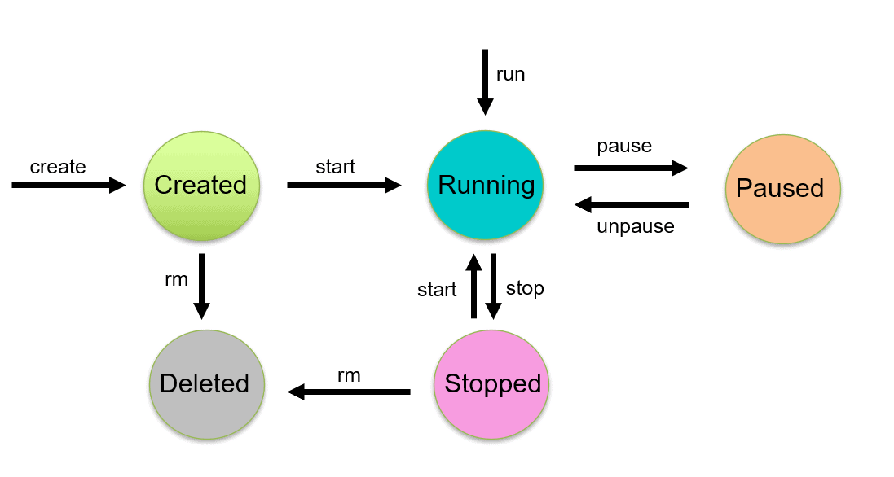

# Containerization Concepts & Container Management Basics

## Container Concepts
Containers are isolated, lightweight, and portable packages that contain only the application and its dependencies. Unlike traditional setups, containers do not include the full operating system, making them highly efficient. The advantages of containerization are as follows:

> **Portability:** Containers can run anywhere, whether on-premises or in the cloud, due to their consistent environment.

> **Isolation:** Containers operate independently of each other, with separate network and file systems. This isolation enhances security and reliability. Communication between containers can be configured as needed.

> **Efficiency:** Containers are resource-efficient because they don't include the operating system. This leads to faster deployment, initialization, and scaling.

> **Consistency:** Containers ensure that the application behaves the same across different environments, facilitating reliable deployments.

> **Scalability:** Containers can be easily scaled in terms of CPU, RAM, etc., and tools like Kubernetes can automate this process.

> **Version Control:** Containers allow version control of applications and environments.

> **Ease of Use:** Containers are user-friendly, simplifying application deployment and management.

## Container Architecture

Containers differ from Virtual Machines (VMs) as they do not require a hypervisor or guest OS. Instead, containers share the host system's OS, making them more lightweight.

> **CRI (Container Runtime Interface):** Ensures communication between the container runtime and orchestration platform, handling permissions and responses.

> **Orchestrator:** Automates container lifecycle management to meet workload and service requirements. Example: Kubernetes.

## Container Tools

> **Docker:** The most popular open-source container platform.

> **CRI-O:** The first container runtime, also open-source.

> **Containerd:** Managed by the Cloud Native Computing Foundation, used by Kubernetes.

> **Microsoft Containers:** Does not utilize CRI.

## Container Lifecycle:



> **Create:** Using a Dockerfile to build an image, which is then used to create a container.

> **Running:** The container is actively executing the application.

> **Paused:** The container's state is preserved, but the processes are halted.

> **Stopped:** The container is halted, and all processes are reset.

> **Killed:** The container is forcefully terminated.

## Container Operations

> **FROM:** Specifies the base image to start with.

> **ENV:** Sets environment variables.

> **WORKDIR:** Defines the working directory inside the container.

> **RUN:** Executes operating system commands (e.g., Linux commands).

> **ENTRYPOINT:** Defines the command that will always run when the container starts; cannot be overridden.

> **CMD:** Specifies the default command to run, which can be overridden.

> **COPY:** Copies files from the local machine into the container image.

> **ADD:** Similar to COPY, but can also handle URLs and tar files.

> **EXPOSE:** Specifies the port on which the container will listen.

## Layering Images
Docker allows layering of images, enabling you to build upon pre-existing images, saving time and resources. For example, you can layer an application on top of a default PostgreSQL image.

## Docker Network

> **Bridge:** The default network driver, used for communication between containers on the same host.

> **Host:** Removes network isolation, allowing the container to use the host's network directly.

> **Overlay:** Connects multiple Docker daemons, enabling communication across nodes without OS-level routing.

> **IPVLAN:** Offers full control over IPv4 and IPv6 addressing, with support for VLAN tagging and routing.

> **MACVLAN:** Assigns a MAC address to a container, making it appear as a physical device on the network, useful for legacy applications that need direct network access.

## Docker Storage

> **TMPFS Mounts:** Temporary storage in host memory, which is not persisted after the container stops.

> **Volume Mounts:** Preferred for persisting data, fully managed by Docker, and independent of the host's directory structure and OS.

> **Bind Mounts:** Mounts a host file or directory into the container using its absolute path, with limited functionality compared to volumes.

## Managing Containers

Essential operations for container management include:

> **Health Checks:** Regularly checking the health of containers to ensure they are functioning correctly.

> **Scaling:** Adjusting the number of containers to handle varying workloads.

> **Deployment:** Managing the release of containers into production environments.

> **Load Balancing:** Distributing traffic across multiple containers to ensure efficient resource utilization and availability.

# Case 1

    Create a Python Web Server.​
    Generate Dockerfile for the Python Web Server you created​
    Create image via Dockerfile​
    Run the image (it won't be down)​
    Push  the image to Dockerhub​
    Push files to GitLab​
    Gitlab'a readme file ve docker file istiyoruz.
  
## Create a Python Web Server
I used ```Flask``` framework to create a web server. The web server contains ```app.py``` and a template file ```hello.html```.

```app.py```:

```python
import os
from flask import Flask, render_template, request, redirect, url_for, session, flash

app = Flask(__name__)

@app.route('/')

@app.route('/hello', methods =['GET', 'POST'])
def hello():
    return render_template('hello.html')

if __name__ == "__main__":
    port = int(os.environ.get('PORT',8000))
    app.run(debug=True, host='0.0.0.0', port=port)


```

```hello.html```:
```html 
<!DOCTYPE html PUBLIC "-//W3C//DTD HTML 4.01//EN" "http://www.w3.org/TR/html4/strict.dtd">
<html>
<body>
<h3 ><span class="s1"><b>OBSS DevOps CodeCamp 2024</b></span></h3>
<h3 ><span class="s1"><b>Alphan Tulukcu</b></span></h3>

</body>
</html>

```

```requirements.txt```:
```
Flask==3.0.2
```

## Generate Dockerfile for the Python Web Server you created​
I prepared a simple ```Dockerfile``` below:
```Dockerfile```:
```Dockerfile
FROM python:3.9-slim-buster
RUN apt-get update
WORKDIR /docker-project
COPY requirements.txt .
RUN pip install -r requirements.txt
COPY . .
CMD ["python", "app.py"]
```
## Create image via Dockerfile​
Having saved all the files into the ```docker-project``` directory, I used the following command to build the ```docker-project``` image:
```bash
docker build -t docker-project .
```
## Run the image (it won't be down)​
After the image is created, I use the ```docker run ``` command like below with ```--restart always``` to run the image in the ```8000``` port without down:
```bash
docker run --restart always -d -p 8000:8000 docker-project:latest
```
With these commands, I can run my server in the ```docker-project``` image, and show the following text in the ```http://127.0.0.1:8000 ``` address:
```
OBSS DevOps CodeCamp 2024

Alphan Tulukcu
```
## Push the image to Dockerhub​
I created a new private repo in the Dockerhub named ```docker-project```, then I use the following command to login my Dockerhub account in the terminal:
```
docker login
```
After that, I change the tag of my local repo to push correctly into the remote repo:
```
docker tag docker-project alphantulukcu/docker-project:lasest
```
Lastly, I use the following command to push the image into remote repo:
```
docker push alphantulukcu/docker-project:lasest   
```
Finally, I can see the image in Dockerhub page like below:


# Case 2

    Create a docker-compose.yaml file. Use the image that we built and pushed to Docker Hub on Hands-On section.​
    Use IPVlan Network driver and give a specific ip address that was provided to you.​
    Expose default port to react-app.​
    Test to connection from your own machine.​

## Create a docker-compose.yaml file. Use the image that we built and pushed to Docker Hub on Hands-On section.​
I created a ```docker-compose.yml``` file below:
```yml
version: '3'
services:
  react-app:
    image: alperbugrabasay/react-app:1.0.0
    container_name: react-app
    networks:
      react-net:
        ipv4_address: 192.168.1.20
    ports:
      - "8000:8000"

networks:
  react-net:
    driver: ipvlan
    driver_opts:
      parent: eth0
    ipam:
      config:
        - subnet: 192.168.1.0/24


```
    
## Use IPVlan Network driver and give a specific ip address that was provided to you.​

As seen in the ```.yml``` file above, I used ipvlan driver to specify ip address, I used ```192.168.1.0/24``` ip adddress in ipam config, and used ```192.168.1.20``` as ```ipv4_address```.
    
    
## Expose default port to react-app.​
In the ```ports:``` section, I gave ```- "8000:8000"``` to expose port 8000 on the host and map it to port 8000 in the container.
    
## Test to connection from your own machine.​
I composed the ```.yml``` file like below:
```
docker-compose up -d 
```

With ```docker ps``` command, I see it is composed:
```
CONTAINER ID   IMAGE                             COMMAND                  CREATED          STATUS          PORTS                    NAMES
2b7262dc5681   alperbugrabasay/react-app:1.0.0   "/bin/sh -c 'npm run…"   10 minutes ago   Up 10 minutes                            react-app
7082e713ca41   docker-project:latest             "python app.py"          23 minutes ago   Up 23 minutes   0.0.0.0:8000->8000/tcp   elegant_clarke

```
With ```docker-compose logs react-app```, I see the logs of the container:
```
react-app  | 
react-app  | > react@0.1.0 start
react-app  | > react-scripts start
react-app  | 
react-app  | Browserslist: caniuse-lite is outdated. Please run:
react-app  |   npx update-browserslist-db@latest
react-app  |   Why you should do it regularly: https://github.com/browserslist/update-db#readme
react-app  | (node:53) [DEP_WEBPACK_DEV_SERVER_ON_AFTER_SETUP_MIDDLEWARE] DeprecationWarning: 'onAfterSetupMiddleware' option is deprecated. Please use the 'setupMiddlewares' option.
react-app  | (Use `node --trace-deprecation ...` to show where the warning was created)
react-app  | (node:53) [DEP_WEBPACK_DEV_SERVER_ON_BEFORE_SETUP_MIDDLEWARE] DeprecationWarning: 'onBeforeSetupMiddleware' option is deprecated. Please use the 'setupMiddlewares' option.
react-app  | Starting the development server...
react-app  | 
react-app  | Compiled successfully!
react-app  | 
react-app  | You can now view react in the browser.
react-app  | 
react-app  |   Local:            http://localhost:3000
react-app  |   On Your Network:  http://192.168.1.20:3000
react-app  | 
react-app  | Note that the development build is not optimized.
react-app  | To create a production build, use npm run build.
react-app  | 
react-app  | assets by path static/ 1.49 MiB
react-app  |   asset static/js/bundle.js 1.48 MiB [emitted] (name: main) 1 related asset
react-app  |   asset static/js/node_modules_web-vitals_dist_web-vitals_js.chunk.js 6.92 KiB [emitted] 1 related asset
react-app  |   asset static/media/logo.6ce24c58023cc2f8fd88fe9d219db6c6.svg 2.57 KiB [emitted] (auxiliary name: main)
react-app  | asset index.html 1.71 KiB [emitted]
react-app  | asset asset-manifest.json 546 bytes [emitted]
react-app  | runtime modules 31.6 KiB 16 modules
react-app  | modules by path ./node_modules/ 1.35 MiB 101 modules
react-app  | modules by path ./src/ 18.2 KiB
react-app  |   modules by path ./src/*.css 9.02 KiB
react-app  |     ./src/index.css 2.72 KiB [built] [code generated]
react-app  |     ./node_modules/css-loader/dist/cjs.js??ruleSet[1].rules[1].oneOf[5].use[1]!./node_modules/postcss-loader/dist/cjs.js??ruleSet[1].rules[1].oneOf[5].use[2]!./node_modules/source-map-loader/dist/cjs.js!./src/index.css 1.42 KiB [built] [code generated]
react-app  |     ./src/App.css 2.72 KiB [built] [code generated]
react-app  |     ./node_modules/css-loader/dist/cjs.js??ruleSet[1].rules[1].oneOf[5].use[1]!./node_modules/postcss-loader/dist/cjs.js??ruleSet[1].rules[1].oneOf[5].use[2]!./node_modules/source-map-loader/dist/cjs.js!./src/App.css 2.15 KiB [built] [code generated]
react-app  |   modules by path ./src/*.js 5.55 KiB
react-app  |     ./src/index.js 1.74 KiB [built] [code generated]
react-app  |     ./src/App.js 2.44 KiB [built] [code generated]
react-app  |     ./src/reportWebVitals.js 1.36 KiB [built] [code generated]
react-app  |   ./src/logo.svg 3.63 KiB [built] [code generated]
react-app  | webpack 5.74.0 compiled successfully in 6259 ms
react-app  | Compiling...
react-app  | Compiled successfully!
react-app  | assets by status 9.49 KiB [cached] 2 assets
react-app  | assets by status 1.48 MiB [emitted]
react-app  |   assets by chunk 1.48 MiB (name: main)
react-app  |     asset static/js/bundle.js 1.48 MiB [emitted] (name: main) 1 related asset
react-app  |     asset main.986e8b374d147dcb86e4.hot-update.js 356 bytes [emitted] [immutable] [hmr] (name: main) 1 related asset
react-app  |   assets by path *.json 699 bytes
react-app  |     asset asset-manifest.json 671 bytes [emitted]
react-app  |     asset main.986e8b374d147dcb86e4.hot-update.json 28 bytes [emitted] [immutable] [hmr]
react-app  |   asset index.html 1.71 KiB [emitted]
react-app  | Entrypoint main 1.48 MiB (1.5 MiB) = static/js/bundle.js 1.48 MiB main.986e8b374d147dcb86e4.hot-update.js 356 bytes 3 auxiliary assets
react-app  | cached modules 1.37 MiB [cached] 109 modules
react-app  | runtime modules 31.6 KiB 16 modules
react-app  | webpack 5.74.0 compiled successfully in 131 ms
```

