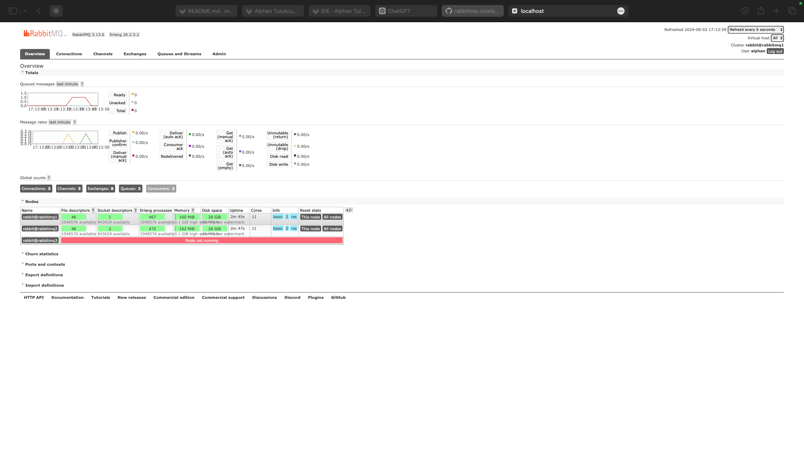
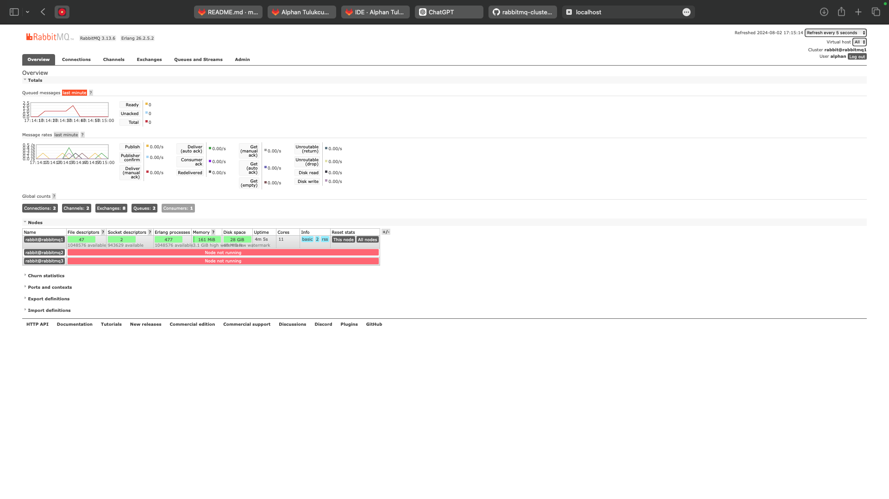

# Message Brokers & Shared Data in Distributed Systems

Distributed systems consist of multiple components (nodes) that need effective communication and coordination.

**Message brokers** act as intermediaries, enabling reliable and asynchronous communication between components, crucial for operations like online payment systems.
 - **Pros**: Guaranteed message delivery, increased performance, scalability.
 - **Cons**: Complexity, learning curve, debugging challenges.

**Message brokers** validate, store, route, and deliver messages across different platforms and languages. They support asynchronous communication, allowing receivers to get messages even when offline.

**Components of Message Brokers** are as follows:
> **Producer/Publisher**: Sends messages to the broker.

> **Queue**: Stores messages in a FIFO manner.

> **Consumer/Subscriber**: Receives messages from the broker.

> **Exchange**: Routes messages to the correct queue.

## Queues
Queues store messages in the order they are received and send them out in the same order.

Messages are requeued if not delivered and handle asynchronous communication, preserving order (FIFO).

## Exchange Types
> **Direct Exchange**: Routes messages to specific queues using a routing key.

> **Fanout Exchange**: Broadcasts messages to all queues associated with the exchange.

> **Topic Exchange**: Routes messages to one or more queues based on matching topics, like following hashtags on Twitter.

## Messaging Broking Patterns
> **Pub/Sub**: Publishers send messages to topics, and subscribers receive messages relevant to their interests.

> **Point-to-Point**: Messages are sent to a specific receiver, ensuring one component processes each message.

> **Request/Reply**: A component sends a request and expects a response, useful in RPC scenarios.

## Message Broker Tools:

### **RabbitMQ**: 

Most popular, supports various protocols, written in Erlang.

Suitable for complex communication with low to moderate message rates.

Supports queue and Pub/Sub methods, with patterns like Many to One and Request/Reply.

### **Kafka**: 
Distributed streaming platform, handles high-throughput and fault-tolerant applications.

Ideal for big data scenarios with long message retention and high fault tolerance.

Utilizes Zookeeper for cluster coordination and leader election.

### **Redis**: 

In-memory data store, extremely fast, supports both Producer-Consumer and Pub/Sub patterns.

Suitable for real-time applications with short retention messages.

# Case 1

## Deploy a RabbitMQ instance using Docker Compose.
I used the management images for RabbitMQ as ```rabbitmq:3.7-management``` image to enable the Web UI. My ```docker-compose.yml``` file is below:
```
version: "3"
services:
  rabbit1:
    image: rabbitmq:3.7-management
    hostname: rabbit1
    ports:
      - "5672:5672"
      - "15672:15672"
    environment:
      - RABBITMQ_DEFAULT_USER=alphan
      - RABBITMQ_DEFAULT_PASS=alphan26
    volumes:
      - ./rabbitmq.conf:/etc/rabbitmq/rabbitmq.conf
      - ./definitions.json:/etc/rabbitmq/definitions.json
    command: ["sh", "-c", "rabbitmq-server"]
```
I created a ```rabbitmq.conf``` file to configure RabbitMQ on the host machine as follows:

```
management.load_definitions = /etc/rabbitmq/definitions.json
```

## Create a definitions.json file to import the initial setup of Queues, Exchanges, and Bindings. Mount this file to the appropriate directory in the RabbitMQ container.

I created a ```definitions.json``` file to configure RabbitMQ. 
    
1. I gave user information, vhost information and arranged permissions:
```
  "users": [
    {
      "name": "alphan",
      "password": "alphan26",
      "tags": "administrator"
    }
  ],
  "vhosts": [
    {
      "name": "/"
    }
  ],
  "permissions": [
    {
      "user": "alphan",
      "vhost": "/",
      "configure": ".*",
      "write": ".*",
      "read": ".*"
    }
  ],
```
2. I created a direct exchange named ```my_exchange``` with ```auto_delete: false``` configration:
```
 "exchanges": [
    {
      "name": "my_exchange",
      "vhost": "/",
      "type": "direct",
      "durable": true,
      "auto_delete": false,
      "internal": false,
      "arguments": {}
    }
  ],
```
3. I created two queues named ```queue1``` and ```queue2``` and arranged bindings with ```route1``` and ```route2``` routing keys:
```
"queues": [
    {
      "name": "queue1",
      "vhost": "/",
      "durable": true,
      "auto_delete": false,
      "arguments": {}
    },
    {
      "name": "queue2",
      "vhost": "/",
      "durable": true,
      "auto_delete": false,
      "arguments": {}
    }
  ],
  "bindings": [
    {
      "source": "my_exchange",
      "vhost": "/",
      "destination": "queue1",
      "destination_type": "queue",
      "routing_key": "route1",
      "arguments": {}
    },
    {
      "source": "my_exchange",
      "vhost": "/",
      "destination": "queue2",
      "destination_type": "queue",
      "routing_key": "route2",
      "arguments": {}
    }
  ]
```

## Producer:
```
import pika
import time
import sys

message = " ".join(sys.argv[1:])

if not message:
    print("No message provided. Exiting.")
    sys.exit(1)

credentials = pika.PlainCredentials('alphan', 'alphan26')
connection_parameters = pika.ConnectionParameters(
    host='localhost',
    port=5672,
    virtual_host='/',
    credentials=credentials
)

connection = pika.BlockingConnection(connection_parameters)
channel = connection.channel()

channel.queue_declare(queue='NewQueue')

channel.basic_publish(exchange='', routing_key='NewQueue', body=message)

print(f"Sent message: {message}")

connection.close()
```

## Consumer:

```
import pika

def on_message_received(ch, method, properties, body):
    print(f"Received new message: {body}")

credentials = pika.PlainCredentials('alphan', 'alphan26')

connection_parameters = pika.ConnectionParameters(host='localhost',port=5672,virtual_host='/',credentials=credentials)

connection = pika.BlockingConnection(connection_parameters)

channel = connection.channel()

channel.queue_declare(queue='NewQueue')

channel.basic_consume(queue='NewQueue', auto_ack=True, on_message_callback=on_message_received)

print("Starting Consuming")

channel.start_consuming()
```

## Running

Terminal 1:
```
docker-compose up --build

```

Terminal 2:
```
source venv/bin/activate
pip install pika
python3 producer.py
```

Terminal 3:
```
source venv/bin/activate
pip install pika
python3 consumer.py <queue_name>
```


# Case 2

Even some are interrupted, the message system continuously running.





