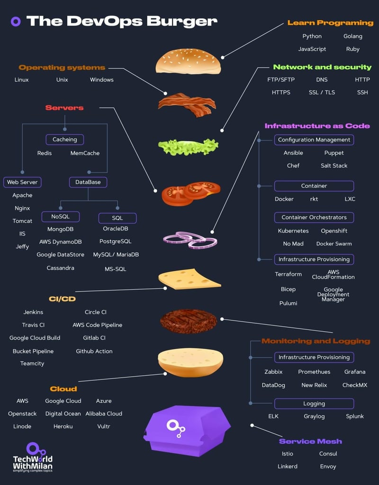

# CI/CD Development 



CI/CD stands for **Continuous Integration (CI)** and **Continuous Delivery/Deployment (CD)**.

**CI** involves regularly integrating code changes into a shared repository, followed by automated builds and tests.

**CD** ensures that these changes are automatically delivered or deployed to production environments.

CI/CD helps in automating integration and deployment, bridging the gap between development and operations teams, improving software quality, and reducing integration issues.

> **Code Integration**: Changes committed to a central repository trigger the build process.

> **Code Testing**: The new code is tested automatically.

> **Code Deployment**: If tests pass, the code is deployed to a staging environment and then promoted to production.

> **Code Promotion**: The final stage where the new code is made available to customers.

## Tools for CI/CD

**SonarQube**: A platform for continuous code quality inspection.

**Harbor**: A secure container registry service.

**Nexus Artifactory**: A centralized repository manager for storing and managing build artifacts.

**HashiCorp Vault**: A secrets and encryption management system.

**Jenkins**: An open-source automation server for CI/CD with extensive plugin support.

## GitHub and GitLab

**GitHub**: A platform for hosting Git repositories with features like GitHub Actions for CI/CD automation.
  - **GitHub Actions**: Automate build, test, and deployment processes triggered by repository events.

**GitLab**: A complete DevOps platform with CI/CD, project management, and security features.
  - **GitLab Pipelines**: Automate CI/CD processes with pipelines defined in a YAML file.


# Case I | Jenkins CI

    onnect the repository you created on GitLab to Jenkins. Make a Jenkinsfile appear on Jenkins by creating a Jenkinsfile in the repository.
    When a change detected on the GitLab Repository, 
    Jenkinsfile must be auto-triggered and run the pipeline

    Define the following operations on Jenkinsfile.

    Operations:

    - Code Build
    - Code Test (ignore the error status if it gives an error.)
    - Code Package (Nexus) - Optional
    - Code Analyze (SonarQube)
    - Dockerize
    - Push Image to Harbor
    - Container Scaninng (Clair or Trivy) - Bonus

## Jenkins
```Jenkinsfile```:
```json
pipeline {
    agent any

    environment {
        SONARQUBE_SERVER = 'codecamp' 
        SONARQUBE_SCANNER_HOME = tool 'codecamp' 
    }

    stages {
        stage('Build') {
            steps {
                script {                    
                    sh 'docker build . -t ci-case-1:latest'
                }
            }
        }

        stage('Test') {
            steps {
                script {
                     sh 'echo "tested"'
                }
            }
        }

        stage('SonarQube Analysis') {
            steps {
                withSonarQubeEnv('codecamp') { 
                    sh "${env.SONARQUBE_SCANNER_HOME}/bin/sonar-scanner \
                        -Dsonar.projectKey=my-project \
                        -Dsonar.sources=. \
                        -Dsonar.host.url=${env.SONAR_HOST_URL} \
                        -Dsonar.login=${env.SONAR_AUTH_TOKEN}"
                }
            }
        }

        stage('Dockerize') {
            steps {
                script {
                    // Build Docker image
                    sh 'docker build -t ci-case-1:latest .'
                }
            }
        }

        stage('Push to Harbor') {
            steps {
                script {            
                    sh "docker login -u alphan.tulukcu -p 371EhOk37L38 https://k8s-master-codecamp24.obss.io:30003/harbor/"
                    sh "docker tag ci-case-1:latest k8s-master-codecamp24.obss.io:30003/codecamp/alphantulukcu/ci-case-1:latest"
                    sh "docker push k8s-master-codecamp24.obss.io:30003/codecamp/alphantulukcu/ci-case-1:latest"
                    
                }
            }
        }

        stage('Container Scan') {
            steps {
                script {
                    sh 'apt-get update && apt-get install -y wget'
                    sh 'wget https://github.com/aquasecurity/trivy/releases/download/v0.22.0/trivy_0.22.0_Linux-ARM64.deb'
                    sh 'dpkg -i trivy_0.22.0_Linux-ARM64.deb'
                    
                    sh 'trivy image k8s-master-codecamp24.obss.io:30003/codecamp/alphantulukcu/ci-case-1:latest'
                }
            }
        }
    }
}

```
## Pipeline Overview


## Harbor Image


# Bonus

I added container scanning using ```trivy Linux-arm064```:


# Case II - GitHub Actions

    Create a Python API / Java / dotNet / Javascript Project (Select one)
    Make a GitHub Workflow appear on GitHub Actions by creating a workflow in the repository.
    When a change detected on the GitHub Repository, GitHub Actions must be auto-triggered and run the pipeline
    Define the following operations on GitHub Wokflow.

    Operations (Stages):
    1. Code Build
    2. Code Test (ignore the error status if it gives an error.)
    3. Code Analyze (SonarQube)
    4. Dockerize
    5. Push Image to DockerHub
    6. Container Scaning (Clair or Trivy) 

```ci.yml```:

```yml
name: CI

on:
  push:
    branches:
      - main
  pull_request:
    branches:
      - main

jobs:
  build:
    runs-on: ubuntu-latest

    steps:
    - name: Checkout code
      uses: actions/checkout@v2

    - name: Set up Python
      uses: actions/setup-python@v2
      with:
        python-version: '3.9'

    - name: Install dependencies
      run: |
        python -m pip install --upgrade pip
        pip install -r requirements.txt

  test:
    runs-on: ubuntu-latest
    needs: build

    steps:
    - name: Checkout code
      uses: actions/checkout@v2

    - name: Set up Python
      uses: actions/setup-python@v2
      with:
        python-version: '3.9'

    - name: Install dependencies
      run: |
        python -m pip install --upgrade pip
        pip install -r requirements.txt

    - name: Run tests
      run: |
        python -m unittest discover || true


  analyze:
    runs-on: ubuntu-latest
    needs: test

    steps:
    - name: Checkout code
      uses: actions/checkout@v2

    - name: Set up Python
      uses: actions/setup-python@v2
      with:
        python-version: '3.9'

    - name: Install dependencies
      run: |
        python -m pip install --upgrade pip
        pip install -r requirements.txt

    - name: SonarQube Scan
      uses: SonarSource/sonarcloud-github-action@master
      env:
        SONAR_TOKEN: ${{ secrets.SONAR_TOKEN }}
      with:
        projectBaseDir: .
        args: >
          -Dsonar.projectKey=GitHubWorkFlow
          -Dsonar.organization=GitHubWorkFlow
          -Dsonar.host.url=${{ secrets.SONAR_HOST_URL }}

  dockerize:
    runs-on: ubuntu-latest
    needs: [build, test, analyze]

    steps:
    - name: Checkout code
      uses: actions/checkout@v2

    - name: Set up Python
      uses: actions/setup-python@v2
      with:
        python-version: '3.9'

    - name: Install dependencies
      run: |
        python -m pip install --upgrade pip
        pip install -r requirements.txt

    - name: Dockerize
      run: |
        echo "Building Docker image"
        docker build -t ci-case-2 .
        echo "Listing Docker images after build"
        docker images
        echo "Verifying Docker image exists"
        if [[ "$(docker images -q ci-case-2:latest 2> /dev/null)" == "" ]]; then
          echo "Docker image ci-case-2:latest not found"
          exit 1
        fi

    - name: Tag Docker Image
      run: |
        echo "Tagging Docker image"
        docker tag ci-case-2:latest ${{ secrets.DOCKER_USERNAME }}/ci-case-2:latest
        echo "Listing Docker images after tagging"
        docker images
        echo "Verifying Docker image tagging"
        if [[ "$(docker images -q ${{ secrets.DOCKER_USERNAME }}/ci-case-2:latest 2> /dev/null)" == "" ]]; then
          echo "Docker image ${{ secrets.DOCKER_USERNAME }}/ci-case-2:latest not found"
          exit 1
        fi

  push:
    runs-on: ubuntu-latest
    needs: dockerize

    steps:
    - name: Checkout code
      uses: actions/checkout@v2

    - name: Log in to DockerHub
      uses: docker/login-action@v2
      with:
        username: ${{ secrets.DOCKER_USERNAME }}
        password: ${{ secrets.DOCKER_PASSWORD }}

    - name: Push Docker image
      run: |
        docker images
        echo "Verifying Docker image tagging"
        if [[ "$(docker images -q ${{ secrets.DOCKER_USERNAME }}/ci-case-2:latest 2> /dev/null)" == "" ]]; then
          docker build -t ci-case-2 .
          docker tag ci-case-2:latest ${{ secrets.DOCKER_USERNAME }}/ci-case-2:latest
        fi
        echo "Pushing Docker image"
        docker push ${{ secrets.DOCKER_USERNAME }}/ci-case-2:latest

  container-scan:
    runs-on: ubuntu-latest
    needs: push

    steps:
    - name: Download Trivy
      run: |
        sudo apt-get install -y wget
        wget https://github.com/aquasecurity/trivy/releases/download/v0.22.0/trivy_0.22.0_Linux-64bit.deb
        sudo dpkg -i trivy_0.22.0_Linux-64bit.deb

    - name: Scan Docker image
      run: |
        trivy image ${{ secrets.DOCKER_USERNAME }}/ci-case-2:latest
```

# The below cases has same structures, first one will be explained in CD part!!!

# Case I - CI/CD on Python
Build a multipage Python web application, integrate CI/CD with Docker, SonarScanner, and dynamic analysis.

# Case II - CI/CD on JavaScript: 
Create a NodeJS/ReactJS application, automate CI/CD with Docker and SonarScanner.

# Case III - CI/CD on Java 
Develop a Maven-based Java application with CI/CD integration, including static and dynamic code analysis.

# Case IV - CI/CD on .NET: 
Build a .NET Core application with CI/CD pipeline, Dockerization, and code analysis.


